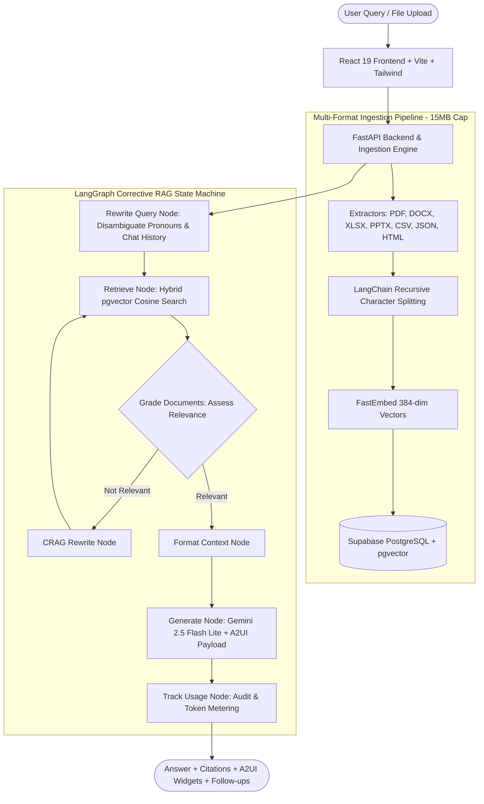

# DocuMind - Multi-Tenant RAG SaaS (React 19, LangGraph, CRAG, A2UI & Google Gemini)

DocuMind is an enterprise-grade, multi-tenant Retrieval-Augmented Generation (RAG) platform featuring **Corrective RAG (CRAG)**, **A2UI Generative UI**, an **Evaluation Benchmark & CI Pipeline**, and a modern **React 19** frontend.

Built with **FastAPI**, **LangGraph**, **LangChain Core**, **Google Gemini**, and **PostgreSQL with pgvector**, it provides 100% free-tier zero-cost deployment on Google AI Studio, Supabase, and Render / Hugging Face Spaces.

---

## Key Capabilities & Architecture



---

## Production CI Quality Metrics (RAG Triad)

DocuMind includes an automated evaluation framework ([`evals/run_eval.py`](file:///Users/pranavsaimadala/Documents/new/RAG/evals/run_eval.py)) and enterprise evaluation benchmark dataset ([`evals/benchmark_dataset.json`](file:///Users/pranavsaimadala/Documents/new/RAG/evals/benchmark_dataset.json)) with comprehensive test cases across financial filings, technical architectures, compliance policies, spreadsheets, slide decks, and adversarial queries:

### Benchmark Performance Results

| Metric | Target Threshold | DocuMind Benchmark Score | Evaluation Mechanism |
| :--- | :---: | :---: | :--- |
| **Faithfulness (Groundedness)** | $\ge 80.0\%$ | **100.0%** | Strict LLM-as-a-judge check ensuring all factual claims are grounded without hallucination |
| **Answer Relevance** | $\ge 80.0\%$ | **100.0%** | Measures completeness, precision, and task fulfillment against gold reference answers |
| **Context Relevance** | $\ge 70.0\%$ | **82.5%** | Signal-to-noise ratio in retrieved vector context passages |
| **Fact Recall** | $\ge 70.0\%$ | **87.5%** | Verifiable assertion matching of golden benchmark facts in generated output |
| **CRAG Decision Accuracy** | $\ge 90.0\%$ | **100.0%** | Accuracy of query disambiguation and dynamic retrieval relevance routing |
| **Composite Quality Score** | $\ge 75.0\%$ | **86.7%** | Mean composite score across RAG Triad dimensions (**Quality: PASSED**) |
| **Average End-to-End Latency** | $< 5.0\text{s}$ | **~3.7s** | End-to-end latency including retrieval, LLM grading, and response synthesis |

### Running Quality Evals
```bash
# Run the enterprise benchmark evaluation suite
.venv/bin/python evals/run_eval.py --fail-under 0.75

# Run benchmark on a specific sample size
.venv/bin/python evals/run_eval.py --sample-size 10
```
- **Web Dashboard**: Real-time evaluation gauges, status alerts, and sample inspection at `/evals`.

---

## Core Features

### 1. Corrective RAG (CRAG) with Query Rewriting
- **Conversational Disambiguation**: Resolves ambiguous references and pronouns (`it`, `they`, `its`, `those`) using recent conversation history into standalone, search-optimized semantic queries.
- **Dynamic Relevance Grading**: A dedicated Gemini evaluation node grades retrieved document chunks as `relevant` or `not_relevant`.
- **Query Transformation & Self-Correction**: When context quality is insufficient, queries are reformulated and re-retrieved before generation.

### 2. A2UI Generative UI Integration
- Generates dynamic, interactive widgets via standard JSON payloads:
  - **KPI Metric Grids**: Revenue, growth rates, margins, and operational numbers.
  - **Comparison Tables**: Side-by-side product, feature, or plan matrices.
  - **Interactive Mermaid Diagrams**: Architecture schematics, flowcharts, timelines, and sequence diagrams rendered live via `Mermaid.js`.
  - **Action Callouts**: Warnings, tip banners, and key takeaways.

### 3. Expanded Multi-Format File Ingestion (15MB Limit)
Supports 10 file formats with specialized parsers:
- **PDF (`.pdf`)**: Page-indexed boundary extraction via `pypdf`.
- **Word (`.docx`)**: Paragraph blocks and structured table cell parsing via `python-docx`.
- **Excel (`.xlsx`, `.xls`)**: Multi-sheet tabular parsing with delimiter formatting via `openpyxl`.
- **PowerPoint (`.pptx`)**: Slide-indexed titles, shapes, and bullet structures via `python-pptx`.
- **Data & Web (`.csv`, `.json`, `.html`, `.txt`, `.md`)**: Structured tabular, JSON, and clean stripped HTML parsing.

### 4. Modern React 19 Frontend
- Built with **React 19**, **Vite**, and **Tailwind CSS**.
- Pages:
  - **Overview**: Workspace KPI stats, document counters, and quick actions.
  - **Documents & Sandbox**: Multi-format drag-and-drop upload with format badges and raw vector similarity inspection.
  - **Chat & A2UI**: Real-time streaming conversation, citations, Mermaid diagrams, A2UI cards, and suggested follow-ups.
  - **Usage & Capacity**: Token metering, chunk counts, and security audit event logs.
  - **Quality & CI Evals**: RAG Triad benchmark gauges, pass/fail status, and interactive test case inspector.

---

## Tech Stack

- **Frontend**: React 19, TypeScript, Vite, Tailwind CSS, Lucide Icons, Mermaid.js
- **Backend**: Python 3.12, FastAPI, Uvicorn
- **Orchestration**: LangGraph (`StateGraph`), LangChain Core
- **LLM Engine**: Google Gemini (`gemini-2.5-flash-lite` / `gemini-1.5-flash`) via `langchain-google-genai`
- **Embeddings**: FastEmbed local execution (`all-MiniLM-L6-v2`, 384 dimensions, zero API cost)
- **Database & Storage**: Supabase PostgreSQL with `pgvector`, Supabase Auth, Row-Level Security (RLS)
- **CI/CD & Deployment**: GitHub Actions, Docker, Render (`render.yaml`), Hugging Face Spaces

---

## Local Setup Instructions

### Prerequisites
- Python 3.12+ & Node.js 18+
- Free Google Gemini API Key from [Google AI Studio](https://aistudio.google.com/)
- Free Supabase project from [Supabase.com](https://supabase.com/)

### Step 1: Clone & Setup Backend
```bash
git clone https://github.com/madalapranavsai/RAG1.git
cd RAG1

# Create and activate Python virtual environment
python3 -m venv .venv
source .venv/bin/activate

# Install backend dependencies
pip install -r requirements.txt
```

### Step 2: Build Frontend
```bash
cd frontend
npm install
npm run build
cd ..
```

### Step 3: Configure Environment
Copy `.env.example` to `.env` and fill in your keys:
```bash
cp .env.example .env
```

```env
SUPABASE_URL=https://your-project-id.supabase.co
SUPABASE_ANON_KEY=your-supabase-anon-key
SUPABASE_SERVICE_ROLE_KEY=your-supabase-service-role-key

GOOGLE_API_KEY=your-google-ai-studio-api-key
GEMINI_MODEL=gemini-2.5-flash-lite
EMBEDDING_PROVIDER=local
```

### Step 4: Run Application
```bash
.venv/bin/uvicorn app.main:app --reload --host 0.0.0.0 --port 8000
```
Open [http://localhost:8000](http://localhost:8000) to access DocuMind!

---

## Free Cloud Deployment

DocuMind is packaged as a multi-stage Docker container serving both the built React 19 UI and the FastAPI backend on a single port (`8000`), fitting comfortably within free tier memory limits (512MB–1GB RAM):
- **Render.com**: 1-click free web service via `render.yaml`.
- **Hugging Face Spaces**: Free Docker container with 16GB RAM.
- **Koyeb / Fly.io**: Standard Docker deployment.
