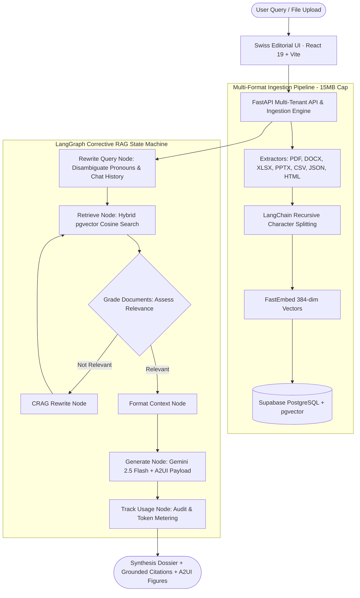

# DocuMind — Multi-Tenant RAG SaaS

[](https://python.org)
[](https://fastapi.tiangolo.com)
[](https://react.dev)
[](https://tailwindcss.com)
[](https://langchain-ai.github.io/langgraph/)
[](https://supabase.com)
[](https://aistudio.google.com)
[](https://opensource.org/licenses/MIT)

DocuMind is an enterprise-grade, multi-tenant Retrieval-Augmented Generation (RAG) platform featuring **Corrective RAG (CRAG)**, **A2UI Generative UI figures**, an automated **Evaluation Benchmark & CI Pipeline**, and a **Swiss & Archival Editorial Design System** (built with React 19).

Built with **FastAPI**, **LangGraph**, **LangChain Core**, **Google Gemini**, and **PostgreSQL with pgvector**, it provides 100% free-tier zero-cost deployment on Google AI Studio, Supabase, and Render / Hugging Face Spaces.

---

## Interactive Architecture & Data Flow

[](https://prlens.dev/c/vyu4IWxy5Uvg9juqLrIQJA)

> 💡 **Interactive Canvas**: Open [https://prlens.dev/c/vyu4IWxy5Uvg9juqLrIQJA](https://prlens.dev/c/vyu4IWxy5Uvg9juqLrIQJA) for the interactive multi-view diagram, animated data flows, and guided walkthrough (no sign-in required).



---

## Production CI Quality Metrics (RAG Triad)

DocuMind includes an automated evaluation framework ([`evals/run_eval.py`](file:///Users/pranavsaimadala/Documents/new/RAG/evals/run_eval.py)) and enterprise evaluation benchmark dataset ([`evals/benchmark_dataset.json`](file:///Users/pranavsaimadala/Documents/new/RAG/evals/benchmark_dataset.json)) with comprehensive test cases across financial filings, technical architectures, compliance policies, spreadsheets, slide decks, and adversarial queries:

### Benchmark Performance Results

| Metric | Target Threshold | DocuMind Benchmark Score | Evaluation Mechanism |
| :--- | :---: | :---: | :--- |
| **Faithfulness (Groundedness)** | $\ge 80.0\%$ | **100.0%** | Strict LLM-as-a-judge check ensuring all factual claims are grounded without hallucination |
| **Answer Relevance** | $\ge 80.0\%$ | **100.0%** | Measures completeness, precision, and task fulfillment against gold reference answers |
| **Context Relevance** | $\ge 70.0\%$ | **82.5%** | Signal-to-noise ratio in retrieved vector context passages |
| **Fact Recall** | $\ge 70.0\%$ | **87.5%** | Verifiable assertion matching of golden benchmark facts in generated output |
| **CRAG Decision Accuracy** | $\ge 90.0\%$ | **100.0%** | Accuracy of query disambiguation and dynamic retrieval relevance routing |
| **Composite Quality Score** | $\ge 75.0\%$ | **86.7%** | Mean composite score across RAG Triad dimensions (**Quality: PASSED**) |
| **Average End-to-End Latency** | $< 5.0\text{s}$ | **~3.7s** | End-to-end latency including retrieval, LLM grading, and response synthesis |

### Running Quality Evals
```bash
# Run the enterprise benchmark evaluation suite
.venv/bin/python evals/run_eval.py --fail-under 0.75

# Run benchmark on a specific sample size
.venv/bin/python evals/run_eval.py --sample-size 10
```
- **Web Dashboard**: Real-time evaluation gauges, status alerts, and sample inspection at `/evals`.

---

## High-End Swiss & Archival Editorial Design System

DocuMind features a bespoke **Archival & Swiss Editorial Design System** designed to eliminate generic AI clichés (such as dark neon cards, purple/cyan glow gradients, and floating glassmorphism):

- **Archival Canvas**: Warm paper and bone palette (`#faf9f5` canvas, `#f4f3ee` navigation rail, `#ffffff` paper sheets).
- **Publication Typography**:
  - **Source Serif 4**: Editorial titles, headlines, and synthesis headings.
  - **Public Sans**: Disciplined Swiss UI controls, labels, and metadata.
  - **JetBrains Mono**: Tabular numbers (`font-variant-numeric: tabular-nums`), document hashes, and timestamps.
- **Surface Elevation**: Tactile paper sheet elevation (`.paper-sheet`, subtle offset shadow `0 1px 3px rgba(28,25,23,0.04)`) with disciplined hairline borders (`#e5e3dc`).
- **Core Product Views**:
  - **Archival Rail**: Minimalist navigation rail with numbered index folios (`01`–`05`) and active sheet states.
  - **Archival Register (`/documents`)**: Folio catalog (`№ 001`, `№ 002`), format stamps (`[PDF]`, `[DOCX]`), chunk counters, blueprint drag-and-drop zone, and calibration sandbox.
  - **Executive Research Dossier (`/chat`)**: Structured research transcript, deep charcoal user cards, assistant response sheets with verbatim chunk citation drawers, and desk input composer.
  - **Executive Briefing Dashboard (`/`)**: Hairline-ruled KPI cards, tabular numbers, and live Mermaid system blueprints.
  - **Quality Certification Report (`/evals`)**: Production CI certificate plate, hairline triad gauges, and side-by-side judge score diagnostics.
  - **Operational Ledger (`/usage`)**: Quota progress bars and immutable audit trail table.

---

## Core Features

### 1. Corrective RAG (CRAG) with Query Rewriting
- **Conversational Disambiguation**: Resolves ambiguous references and pronouns (`it`, `they`, `its`, `those`) using recent conversation history into standalone, search-optimized semantic queries.
- **Dynamic Relevance Grading**: A dedicated Gemini evaluation node grades retrieved document chunks as `relevant` or `not_relevant`.
- **Query Transformation & Self-Correction**: When context quality is insufficient, queries are reformulated and re-retrieved before generation.

### 2. A2UI Generative UI Integration
- Generates dynamic, interactive widgets via standard JSON payloads formatted as architectural plates:
  - **Figure // Metric Analysis**: Hairline tiles with tabular values and trend indicators.
  - **Figure // Structured Ledger**: Interactive data tables with client-side search filtering and TSV export.
  - **Figure // System Blueprint**: Interactive Mermaid diagrams rendered live in clean neutral styling.
  - **Figure // Event Sequence**: Minimalist chronological milestone sequences.
  - **Figure // Trend Chart**: Clean Chart.js visual comparisons in charcoal and stone palettes.

### 3. Expanded Multi-Format File Ingestion (15MB Limit)
Supports 10 file formats with specialized parsers:
- **PDF (`.pdf`)**: Page-indexed boundary extraction via `pypdf`.
- **Word (`.docx`)**: Paragraph blocks and structured table cell parsing via `python-docx`.
- **Excel (`.xlsx`, `.xls`)**: Multi-sheet tabular parsing with delimiter formatting via `openpyxl`.
- **PowerPoint (`.pptx`)**: Slide-indexed titles, shapes, and bullet structures via `python-pptx`.
- **Data & Web (`.csv`, `.json`, `.html`, `.txt`, `.md`)**: Structured tabular, JSON, and clean stripped HTML parsing.

---

## Repository Structure

```text
├── app/                          # FastAPI application & LangGraph backend
│   ├── api/                      # Route controllers
│   │   ├── auth.py               # Tenant workspace auth & JWT handling
│   │   ├── chat.py               # RAG session & streaming message endpoints
│   │   ├── documents.py          # Document upload, parsing & retrieval sandbox
│   │   ├── evals.py              # Benchmark execution & reporting endpoints
│   │   └── usage.py              # Token metering & activity audit logs
│   ├── core/                     # Configuration, Supabase client, security
│   ├── db/                       # Supabase database client & helpers
│   ├── extractors/               # Multi-format extractors (PDF, DOCX, XLSX, PPTX, etc.)
│   ├── main.py                   # FastAPI app entry point & SPA static mounting
│   └── rag/                      # Core RAG engine
│       ├── graph.py              # LangGraph CRAG StateGraph workflow
│       ├── llm.py                # Google Gemini 2.5 Flash model client
│       └── vectorstore.py        # Supabase pgvector & FastEmbed integration
├── evals/                        # Enterprise RAG Triad evaluation suite
│   ├── benchmark_dataset.json    # Gold standard Q&A ground truth pairs
│   └── run_eval.py               # Standalone CLI evaluation runner
├── frontend/                     # React 19 + Vite Swiss Editorial client
│   ├── src/
│   │   ├── components/           # Archival shell, ErrorBoundary & Layout
│   │   │   └── a2ui/             # Generative A2UI figure widgets
│   │   ├── pages/                # Dashboard, Chat, Documents, Evals, Usage, Auth
│   │   └── index.css             # Swiss Editorial design tokens & hairline utilities
│   ├── package.json
│   └── vite.config.ts
├── supabase/                     # Supabase database migrations & SQL schemas
│   └── migrations/
│       └── 20260716000000_init.sql  # Core pgvector schema, tables & match_chunks RPC
├── .pr-lens/                     # PR Lens architecture models & SVG manifests
├── Dockerfile                    # Multi-stage production container (React + FastAPI)
└── render.yaml                   # 1-click Render blueprint
```

---

## Interactive REST API Reference

When running locally, FastAPI provides full interactive API documentation:
- **Swagger UI**: [http://localhost:8000/docs](http://localhost:8000/docs)
- **ReDoc UI**: [http://localhost:8000/redoc](http://localhost:8000/redoc)

| Method | Endpoint | Description |
| :--- | :--- | :--- |
| `POST` | `/api/auth/signup` | Register a new tenant account and isolated workspace |
| `POST` | `/api/auth/login` | Authenticate user credentials and issue session JWT |
| `GET` | `/api/auth/me` | Fetch active user profile and tenant workspace details |
| `GET` | `/api/documents` | List all registered documents in the tenant vault |
| `POST` | `/api/documents/upload` | Upload and parse document (PDF, Word, Excel, PPT, etc.) |
| `POST` | `/api/documents/test-search` | Test semantic vector retrieval similarity scores in sandbox |
| `GET` | `/api/chat/sessions` | List all active conversation dossier threads |
| `POST` | `/api/chat/sessions` | Create a new inquiry thread |
| `POST` | `/api/chat/sessions/:id/messages` | Send inquiry prompt, run CRAG, and receive synthesis + A2UI |
| `GET` | `/api/evals/latest` | Retrieve latest RAG Triad benchmark certification report |
| `POST` | `/api/evals/trigger` | Trigger live LLM-as-a-judge quality benchmark run |
| `GET` | `/api/usage/stats` | Retrieve token consumption metrics and activity audit log |

---

## Local Setup Instructions

### Prerequisites
- Python 3.12+ & Node.js 18+
- Free Google Gemini API Key from [Google AI Studio](https://aistudio.google.com/)
- Free Supabase project from [Supabase.com](https://supabase.com/)

### Step 1: Clone Repository & Virtual Environment
```bash
git clone https://github.com/madalapranavsai/RAG1.git
cd RAG1

# Create and activate Python virtual environment
python3 -m venv .venv
source .venv/bin/activate

# Install backend dependencies
pip install -r requirements.txt
```

### Step 2: Initialize Supabase Database
1. Open your project dashboard at [supabase.com](https://supabase.com/).
2. Navigate to the **SQL Editor**.
3. Copy and execute the contents of [`supabase/migrations/20260716000000_init.sql`](file:///Users/pranavsaimadala/Documents/new/RAG/supabase/migrations/20260716000000_init.sql). This enables `vector`, sets up `documents`, `document_chunks`, and installs the `match_chunks` similarity function.

### Step 3: Configure Environment
Copy `.env.example` to `.env` and fill in your keys:
```bash
cp .env.example .env
```

```env
SUPABASE_URL=https://your-project-id.supabase.co
SUPABASE_ANON_KEY=your-supabase-anon-key
SUPABASE_SERVICE_ROLE_KEY=your-supabase-service-role-key

GOOGLE_API_KEY=your-google-ai-studio-api-key
GEMINI_MODEL=gemini-2.5-flash-lite
EMBEDDING_PROVIDER=local
```

### Step 4: Build Frontend
```bash
cd frontend
npm install
npm run build
cd ..
```

### Step 5: Run Application
```bash
.venv/bin/uvicorn app.main:app --reload --host 0.0.0.0 --port 8000
```
Open [http://localhost:8000](http://localhost:8000) to access DocuMind!

---

## Free Cloud Deployment

DocuMind is packaged as a multi-stage Docker container serving both the built React 19 UI and the FastAPI backend on a single port (`8000`), fitting comfortably within free tier memory limits (512MB–1GB RAM).

### Local Docker Testing
```bash
# Build the production container
docker build -t documind:latest .

# Run container locally with environment file
docker run -p 8000:8000 --env-file .env documind:latest
```

### Deployment Targets
- **Render.com**: 1-click free web service via [`render.yaml`](file:///Users/pranavsaimadala/Documents/new/RAG/render.yaml).
- **Hugging Face Spaces**: Deploy as a free Docker Space with 16GB RAM.
- **Koyeb / Fly.io**: Deploy directly from GitHub repository using Dockerfile.

---

## License

This project is licensed under the MIT License — see the [LICENSE](LICENSE) file for details.
