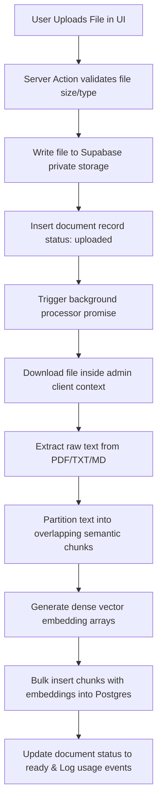
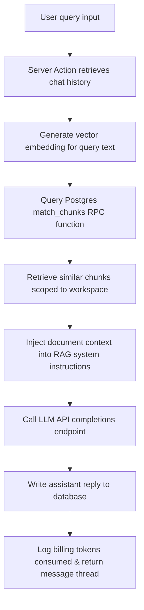

# DocuMind - Multi-Tenant RAG SaaS Platform

DocuMind is a high-performance, multi-tenant Retrieval-Augmented Generation (RAG) SaaS platform built with Next.js, Supabase, Postgres pgvector, and local client-free AI pipelines.

---

## Architecture Flow

### 1. Ingestion Pipeline
When a user uploads a knowledge document, the system processes it asynchronously in the background:



### 2. RAG Retrieval & Chat Flow
When a user asks a question in a conversation session, the context is fetched and formulated:



---

## Tech Stack
- **Framework**: Next.js (App Router, Server Actions, React 19)
- **Styling**: Tailwind CSS
- **Database & Storage**: Supabase (PostgreSQL with `pgvector` extension)
- **Authentication**: Supabase Auth (Cookie-based session middleware validation)
- **Embeddings**: Transformers.js running in-process (Hugging Face `all-MiniLM-L6-v2`) or OpenAI API (`text-embedding-3-small`)
- **LLM Engine**: OpenAI Chat Completion API (`gpt-4o-mini`)
- **Containers**: Docker Compose (for local Postgres vector database testing)

---

## Local Setup Instructions

### Prerequisites
- Docker & Docker Compose installed.
- Node.js (version 20+ / 22+).
- An OpenAI API Key (if using OpenAI completion/embedding routes).

### Step 1: Start Database Container
Boot the local PostgreSQL database configured with the `pgvector` extension:
```bash
docker compose up -d
```

### Step 2: Supabase Schema Configuration
Apply the database schemas and RLS security triggers. If using Supabase Local CLI, run `supabase start` or manually apply migrations located in the `supabase/migrations/` directory against your database instance:
1. `20260716000000_init.sql` (Creates base schemas and `match_chunks` function).
2. `20260716000100_auth_triggers.sql` (Autogenerates default profile/workspaces on sign-up).
3. `20260716000200_rls_policies.sql` (Activates Row Level Security).
4. `20260716000300_storage_policies.sql` (Applies path-isolated storage policies).

### Step 3: Configure Environment Variables
Copy `.env.example` to `.env.local` and populate the configuration keys:
```bash
cp .env.example .env.local
```

```env
NEXT_PUBLIC_SUPABASE_URL=http://localhost:54321
NEXT_PUBLIC_SUPABASE_ANON_KEY=your-supabase-anon-key
SUPABASE_SERVICE_ROLE_KEY=your-supabase-service-role-key

EMBEDDING_PROVIDER=local
# Optional: OpenAI embeddings fallback
# EMBEDDING_PROVIDER=openai
# EMBEDDING_MODEL=text-embedding-3-small

LLM_PROVIDER=openai
LLM_MODEL=gpt-4o-mini
LLM_API_KEY=sk-proj-your-openai-api-key
```

### Step 4: Run Application
Install dependencies and launch the Next.js development server:
```bash
npm install
npm run dev
```

Open [http://localhost:3000](http://localhost:3000) to view the onboarding registration page.

---

## Features Walkthrough

### 1. Multi-Tenant Workspace Protection
Upon registering, every user is auto-allocated a default workspace. Access to database tables (`profiles`, `documents`, `document_chunks`, `chats`, `chat_messages`) is strictly constrained to workspace members via RLS helper definers.

### 2. Document Parsing
Upload PDF, TXT, or MD files via the drag-and-drop dropzone dashboard. Text is chunked in blocks of 3000 characters (with 500 characters overlap) and embedded locally using ONNX feature-extraction models.

### 3. Sandbox Debugger
Query vector contents directly in the **Retrieval Sandbox** at the bottom of the Documents page to view rank matches, document citations, and cosine similarity margins.

### 4. Interactive Chat
Engage in session-tracked discussions. Conversations automatically retrieve matching segments, context-bind questions, and update thread titles.

### 5. Analytics & Metrics
Inspect resource usage bars on the **Usage** dashboard to monitor workspace capacities against Free Sandbox limits (10 uploads, 500 chunks, 100K tokens).
