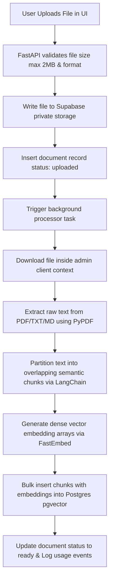
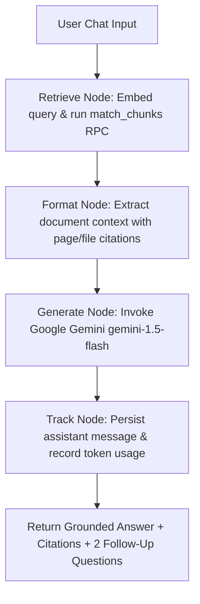

# DocuMind - Multi-Tenant RAG SaaS (Python Full-stack with LangGraph & Google Gemini)

DocuMind is a high-performance, multi-tenant Retrieval-Augmented Generation (RAG) SaaS platform built with **FastAPI**, **LangGraph**, **LangChain**, **Google Gemini**, and **PostgreSQL with pgvector**. It features 100% zero-cost deployment on free hosting tiers (Google AI Studio free API, Supabase free tier, Render / Hugging Face Spaces free container hosting).

---

## Architecture Flow

### 1. Ingestion Pipeline
When a user uploads a knowledge document (PDF, TXT, or Markdown), it is processed asynchronously in the background:



### 2. LangGraph RAG Retrieval & Chat Flow
When a user asks a question, the conversation flows through a compiled **LangGraph** `StateGraph`:



---

## Tech Stack
- **Backend & Full-stack Web Framework**: Python 3.12, FastAPI, Jinja2, Uvicorn
- **RAG Orchestration**: LangGraph (`StateGraph`), LangChain Core, `langchain-text-splitters`
- **LLM Engine**: **Google Gemini** (`gemini-1.5-flash` / `gemini-2.0-flash`) via `langchain-google-genai` (100% Free Tier)
- **Embeddings**: FastEmbed in-process local execution (`sentence-transformers/all-MiniLM-L6-v2`, 384 dimensions, zero API cost) or Gemini `text-embedding-004`
- **Database & Storage**: Supabase (PostgreSQL with `pgvector`, Supabase Auth, Supabase Storage)
- **PDF Extraction**: `pypdf`
- **Containerization & Deployment**: Docker, Render.com Blueprint (`render.yaml`), Hugging Face Spaces

---

## Local Setup Instructions

### Prerequisites
- Python 3.12+
- A free Google Gemini API Key from [Google AI Studio](https://aistudio.google.com/)
- A free Supabase project from [Supabase.com](https://supabase.com/)

### Step 1: Clone & Create Virtual Environment
```bash
git clone https://github.com/madalapranavsai/RAG1.git
cd RAG1

# Create and activate Python virtual environment
python3 -m venv .venv
source .venv/bin/activate

# Install dependencies
pip install -r requirements.txt
```

### Step 2: Supabase Schema Configuration
In your Supabase project SQL Editor, run the SQL migrations from `supabase/migrations/`:
1. `20260716000000_init.sql` (Creates base schemas, `pgvector`, and `match_chunks` function).
2. `20260716000100_auth_triggers.sql` (Autogenerates default profile/workspaces on sign-up).
3. `20260716000200_rls_policies.sql` (Row Level Security).
4. `20260716000300_storage_policies.sql` (Path-isolated storage policies).

### Step 3: Configure Environment Variables
Copy `.env.example` to `.env` and fill in your keys:
```bash
cp .env.example .env
```

```env
SUPABASE_URL=https://your-project-id.supabase.co
SUPABASE_ANON_KEY=your-supabase-anon-key
SUPABASE_SERVICE_ROLE_KEY=your-supabase-service-role-key

GOOGLE_API_KEY=your-google-ai-studio-api-key
GEMINI_MODEL=gemini-1.5-flash
EMBEDDING_PROVIDER=local
```

### Step 4: Run Application
```bash
uvicorn app.main:app --reload --host 0.0.0.0 --port 8000
```
Open [http://localhost:8000](http://localhost:8000) to view your application!

---

## Free Cloud Deployment

See [deployment.md](file:///Users/pranavsaimadala/Documents/new/RAG/deployment.md) for 1-click zero-cost deployment instructions on:
- **Render.com** (Free Web Service via `render.yaml` or `Dockerfile`)
- **Hugging Face Spaces** (Free Docker container with 16GB RAM)
- **Koyeb** (Free Nano container)

---

## Features Walkthrough

### 1. Multi-Tenant Workspace Protection
Every user registration automatically provisions an isolated workspace. Documents, vector chunks, chat sessions, and usage records are strictly scoped to the active workspace with Row-Level Security (RLS).

### 2. Knowledge Document Parsing & Chunking
Upload PDF, TXT, or Markdown files up to 2MB. Files are chunked in overlapping blocks of 3,000 characters (500 overlap) and embedded locally using FastEmbed.

### 3. Retrieval Sandbox
Test raw vector similarity matching directly from the **Documents** page to view rank matches, document citations, and cosine similarity margins.

### 4. Interactive LangGraph Chat
Engage in session-tracked discussions. LangGraph executes query retrieval, context formatting, Gemini response generation, citation card extraction, and two suggested follow-up questions.

### 5. Capacity & Usage Analytics
Real-time progress bars monitor workspace resource consumption against Free Sandbox quotas (10 uploads, 500 chunks, 100K tokens) with complete audit event logs.
